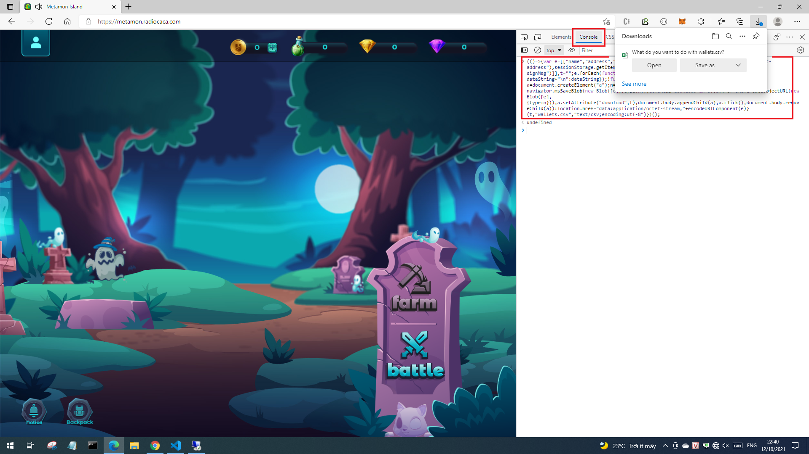

# MetamonPlay-iOS
Simple script to play Metamon Island game automatically on iOS

For Android: <i>Comming soon...</i>

# Getting Started

[Radio Caca]

[Radio Caca]: https://www.radiocaca.com

## Important disclaimer
This script is writen with javascript, it only run on [Scriptable] application for iOS. It uses
sensitive signature code from MetaMask wallet which 
needs to be safe and secure at all times. Make sure 
to inspect the code for any attempts to send your 
information anywhere except https://metamon-api.radiocaca.com/usm-api 
(official metamon game api). We are not responsible 
for any loss incurred when you use this script!

[Scriptable]: https://scriptable.app/

## Prerequisites

To start using this script on iOS devices (iPhone, iPad), your's device needs to be 
installed [Scriptable] app.

[Scriptable]: https://scriptable.app/

## Prepare wallet(s) information

First open [game] with your browser and make sure 
your wallet is active in MetaMask plugin. Enter
dev mode in browser (Chrome press Ctrl + Shift + I,
or go to menu -> More Tools -> Developer Tools)

select "Network" and "Fetc/XHR" in developer tools menu.

[game]: https://metamon.radiocaca.com

! <b>Imoprtant: make sure to do it before signing 
in with MetaMask</b> !

After login success in to the game, switch to <b>Console</b> tab of developers tools, paste the bellow script then press Enter.

    (()=>{var e=[["name","address","sign","msg"],["Wallet1",sessionStorage.getItem("account-address"),sessionStorage.getItem("connect-sign"),sessionStorage.getItem("connect-signMsg")]],t="";e.forEach(function(n,a){dataString=n.join(","),t+=a<e.length?dataString+"\n":dataString});!function(e,t,n){var a=document.createElement("a");n=n||"application/octet-stream",navigator.msSaveBlob?navigator.msSaveBlob(new Blob([e],{type:n}),t):URL&&"download"in a?(a.href=URL.createObjectURL(new Blob([e],{type:n})),a.setAttribute("download",t),document.body.appendChild(a),a.click(),document.body.removeChild(a)):location.href="data:application/octet-stream,"+encodeURIComponent(e)}(t,"wallets.csv","text/csv;encoding:utf-8")})();
    
A wallets.csv file will auto downloaded

Send files to iOS device, then put them in to iCloud drive

# Preparation is complete! 
## Ready to roll?

Open Scriptable app, you can see MetamonPlay script, tap on it and fighting

Will try to read file wallets.csv in iCloud drive,
auto fight, mint eggs, and save stats to corresponding 
files. Now you ready to have fun and explore other options.

<b> Note: </b> Since fee for all leagues is the same bot will 
try to fight in highest league for corresponding metamon and 
it is not configurable at this 
time.

Also if there will be interest we can release version which
uses access token instead of signature (tokens expire and it
is more secure to use, however it will require manual step of
obtaining one every day for battles)

Hope you will have fun playing and this script will make it 
a little bit less tedious. Enjoy!

<b>₿₿₿ Send me some Raca if you feel happy:</b>

    0x5c78c7F9D078c82EEc2b083aa622aaFDb82AEad3
